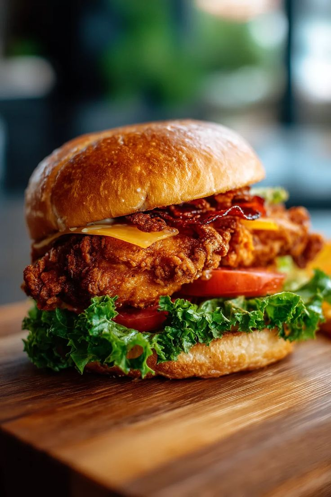
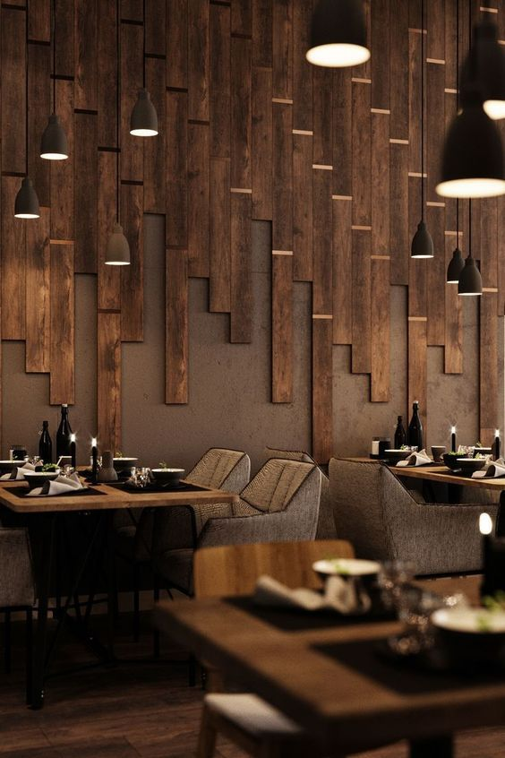

<html lang="en">
<head>
  <meta charset="UTF-8">
  <title>BBD (Big Bite Dinner) Resturant & Cafe</title>
  
</head>
<body>
   

  <meta name="viewport" content="width=device-width, initial-scale=1.0">

  <header>
    <h2>Enjoy An Unforgettable Experience</h2>
    <h1>Fashkala Resturant & Cafe</h1>
     
    <h3 class="slogan">"we dont just sell food... , we sell a delightful experience where every bite meets happiness and every sip meets a smile"<h3>
        
    

      <a href="menu.html" target="_self" class="card">
        
        

          <h3>Our Main Menu</h3>
        

      </a>
      <a href="booking.html" target="_self" class="card">
        
        

          <h3>Book Your Table</h3>
        

      </a>
    

  </header>

  <section class="section">
    

     BBD, founded in 2025, is dedicated to all those who love to wander far and wide. 
      We invite you on a wholesome culinary adventure, where you’ll explore undiscovered gourmet experiences.
    

    

      Thank you for creating lasting memories with us.
    

    

      For more information visit our social media accounts. If you have any problems please contact us through them.
    

  </section>

  

    
    
    
    
  
  

   
</body>
</html>

